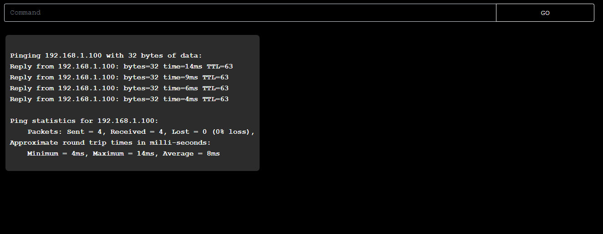

# Browser Command Prompt
A simple local command prompt run in a browser

## Description
This is a very simple full stack project that turns your browser into a local command prompt window. 

## Table of Contents 
* [Technologies](#Technologies) 
* [Usage](#Usage)
* [License](#License)
* [Badges](#Badges)
* [Tests](#Tests)
* [Questions](#Questions)

## Technologies
* This application is written fully in Javascript, using node.js for backend.
* It uses Express for backend routes.
* It uses the child_process module for spawning subprocesses.

## Usage
To run, run 'npm install' to install required npm packages. Then run 'node src' to run locally on port 5000.

## License
MIT

## Badges

 

## Tests
No tests are currently in place for this project. 

## Questions 
 For any questions, contact me at [maxxsanner105@gmail.com](mailto:maxxsanner105@gmail.com).
#### 

